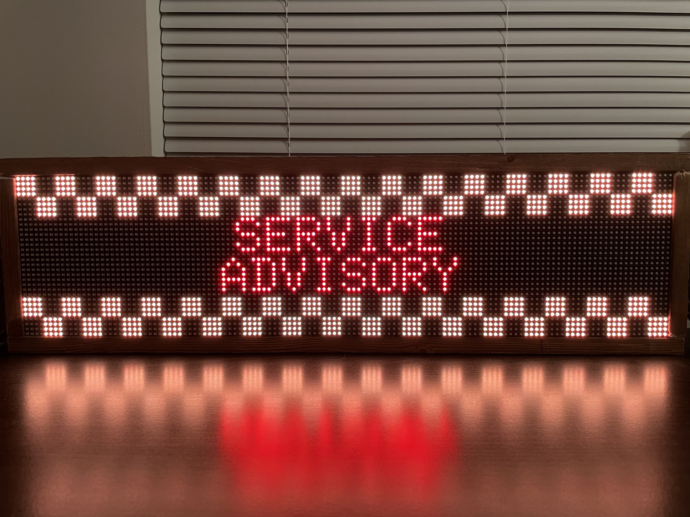

# rpi-metro-display

Python code for DC metrorail times display.

> :warning: **Users Prior to 11/12/2023: This project has been updated to use Python 3, see [this doc](https://www.python.org/doc/sunset-python-2/#:~:text=The%20sunset%20date%20has%20now,when%20we%20released%20Python%202.7.) for information on the sunsetting of Python 2. If your display is working fine with Python 2 and you don't wish to upgrade, be advised that pulling the latest code will break your display until you update to Python 3. If you've already pulled the latest code by mistake, please either use the branch `v1.x` or release `v1.0.5`.**

A WMATA API Key is needed to get live train data. API keys are free and you can sign up for one [here](https://developer.wmata.com/).


In addition to displaying metro times it also displays alerts for the lines that run through the station being displayed.




## API

This program exposes an API (Flask dev server). It can be used to change the station by name and terminal name while the display is running. You'll need to use an HTTP client on your computer like cURL or if you prefer a GUI client something like the free version of [Postman](https://www.postman.com/).

The API runs on port 5000. For example if your Pi's IP address is 192.168.1.2, your requests should start with `http://192.168.1.2:5000`.

### GET /state

State returns the name of the station being displayed set to as well as the terminal stations for the direction. For example, if your display is set to Metro Center on the Orange/Silver/Blue track toward Virginia:

Request:
```sh
curl http://192.168.1.2:5000/state
```

Response:
HTTP Status 200
```json
{
    "directions": [
        "wiehle reston east",
        "franconia springfield",
        "vienna fairfax gmu"
    ],
    "stationName": "metro center"
}
```

### PUT /station/name

PUT `/station/name` changes the station and direction. This uses the WMATA stations API to get station and terminal station names. It's not case sensitive, all punctuation is removed, and it's done by prefix so the full names don't have to typed out. For example, to switch to L'Enfant Plaza in the direction of Franconia Springfield the request/response can look like this:

_NOTE: It may take up to 5 seconds for your change to show on the display or if incidents (service advisory/scheduled track work) are being shown, 5 seconds after the incidents are done being reported._

Request:
```sh
curl --location --request PUT '192.168.1.2:5000/station/name' \
--header 'Accept: application/json' \
--header 'Content-Type: application/json' \
--data-raw '{
	"stationName": "lenfant",
	"directionOf": "franconia"
}'
```

Response:
HTTP Status 202
```json
{
    "directions": [
        "wiehle reston east",
        "franconia springfield",
        "vienna fairfax gmu"
    ],
    "stationName": "lenfant plaza"
}
```

### POST /station/code (Deprecated)

I don't recommend using this API, I'm documenting it only because it exists. Please use `PUT /station/name` instead.

This changes the station by code. It's very error prone and if you plug in an invalid station code it will NOT complain and it will crash the program. It's also important to point out that this does NOT allow you to change the direction. Whatever direction code the display had before will continue to be used.

Request:
```sh
curl --location --request POST '192.168.1.2:5000/station/code' \
--header 'Accept: application/json' \
--header 'Content-Type: application/json' \
--data-raw '{
	"station": "K01"
}'
```

Response:
HTTP Status 204 (No Content)
_NOTE: If you're using cURL, this return without saying anything._

### GET /direction (Deprecated)

I don't recommend using this API, I'm documenting it only because it exists. Please use `PUT /station/name` instead.

This allows you to toggle the direction code (between 1 and 2).

Request:
```sh
curl 192.168.1.2:5000/direction
```

Response:
HTTP Status 202
```json
{
    "directions": [
        "largo town center",
        "new carrollton"
    ],
    "stationName": "court house"
}
```

## Hardware

- Raspberry Pi 3B or later
- 16GB+ Micro SD Card
- USB SD Card Reader
- [Adafruit Matrix Hat](https://www.adafruit.com/product/2345)
- 2x [64x32 Dot Matrix Display](https://www.adafruit.com/product/2277)
	- I've linked the 5mm pitch which is what I have, but the 6mm, 4mm, and 3mm should work too as long as the dimensions are the same.
	- The displays will be put side by side to create a 128x32 display.
- 5V Display Power Supply
	- I'm not an electrical engineer so please check your display and the [Adafruit Hat's](https://www.adafruit.com/product/2345) documentation for power consumption to determine what size power supply you need.
- Power supply for Raspberry Pi
	- CanaKit sells bundles that come with both a Pi and a power supply. *If you have the display set to turn on automatically, plug in the Hat first, then the Pi.*

## Assembly

I'm not going to do a step by step for this part because the components above are mostly off the shelf and have their own assembly guides. However, there are a couple things I want to point out.

First, the Adafruit Matrix Hat does not come with the headers soldered on so you'll need to do that yourself. Adafruit has an [assembly guide with pictures](https://learn.adafruit.com/adafruit-rgb-matrix-plus-real-time-clock-hat-for-raspberry-pi/assembly).

Second, you'll have to chain the data ports of the two displays together to make this work. Ensure that you're connecting the data output of the first display to the input of the second as shown below.


## Install Pi OS and Pre-requisites

Theoretically you can use any Raspberry Pi OS to run this, but in this guide I will be using DietPi, a lightweight Debian OS designed for Raspberry Pi and other SBCs.

1. Follow the first 2 steps from the [official DietPi installation guide](https://dietpi.com/docs/install/).

2. Configure the SD card to connect to Wi-Fi on first boot
    - Open the freshly flashed SD card on your computer (you may need to unplug it and plug it back in for it to show up).
    - In `dietpi.txt` set `AUTO_SETUP_NET_WIFI_ENABLED` to 1.
    - In `dietpi.txt` set `AUTO_SETUP_TIMEZONE` to your timezone. I'm guessing for most folks that'll be `America/New York`.   
    - In `dietpi-wifi.txt` set `aWIFI_SSID[0]` to your network name (make sure to do it within single quotes like so `'my-network-name'`), and set `aWIFI_KEY[0]` to your network password.
    - Save both files.

See the images below for examples:


3. Put the SD card in your Raspberry Pi and connect it to power.
    - It make take several minutes to boot up the first time, don't worry.

4. First Login
    - After a few minutes, the Pi should have booted up and connected to your Wi-Fi network. Now you need to figure out how to log in.
    - Follow the instructions for step 4 from the section "Click here if you want to connect via network (running a _headless install_)" [here](https://dietpi.com/docs/install/#4-first-logon-on-dietpi).
    - If these steps don't work for you, you can also connect an HDMI cable and keyboard to your Pi and find the IP address that way.

_NOTE: If you’re on Mac, you can also use `nmap`. I recommend using Homebrew to install it. If you don’t have Homebrew you can get it from [here](https://brew.sh). Once you have brew, run `brew install nmap`._

_NOTE: Depending on your network, the IP range may be different than in the DietPi instructions. Common ranges are 192.168.1.0/24 and 10.0.0.0/24._

5. Finish Installation
    - Once DietPi finishes updating, it will give you the option to install additional software. Skip this step and select `Install` at the bottom.
    - When you select install it will warn you that you are going to get a minimal installation. This is fine, we’ll add everything we need later.

## Install rpi-metro-display

1. Re-Login as the `dietpi` user
    - After the installation completes you'll be presented with a terminal as root. Type `exit` to disconnect.
    - `ssh dietpi@<pi-IP-address>`

Root Terminal:


2. Install pre-requisite software

```sh
sudo apt install build-essential python3 python3-all-dev python3-setuptools python3-wheel python3-pip git zlib1g-dev libopenjp2-7 cython3
```

- This will install basic development tools and Python all of which are required to run the display.

3. Create and enter `metro-sign` directory

```sh
mkdir metro-sign
cd metro-sign
```

4. Download the [rpi-rgb-led-matrix](https://github.com/hzeller/rpi-rgb-led-matrix) driver library

```sh
git clone https://github.com/hzeller/rpi-rgb-led-matrix.git
```

5. Build and install the driver library
	- If you’re not using the Adafruit Matrix HAT, ignore this next step and refer to the [library’s documentation](https://github.com/hzeller/rpi-rgb-led-matrix).

```sh
cd rpi-rgb-led-matrix
```

- Edit the `lib/Makefile` using the text editor of your choice, `nano` comes pre-installed.

```sh
nano lib/Makefile
```

- Change the value for `HARDWARE_DESC?` from `regular` to `adafruit-hat`. Then hit Ctrl+O and Enter to save, then Ctrl+X to exit.


- Build the libary (this will take a few minutes)

```sh
make build-python PYTHON=$(command -v python3)
```

- Install the library (this will take a few minutes)

```sh
sudo make install-python PYTHON=$(command -v python3)
```

- Run `sudo python3 -m pip freeze` to ensure the library is properly installed. It should return `rgbmatrix==0.0.1`.
- Go back to the `metro-sign` directory

```sh
cd ..
```

6. Download the metro sign code

```sh
git clone https://github.com/kenschneider18/rpi-metro-display.git
```

7. Download additional Python dependencies

```sh
cd rpi-metro-display
sudo python3 -m pip install --break-system-packages -r requirements.txt
```

_NOTE: the pip install must be run with sudo because the `rpi-rgb-led-matrix` driver needs to be run as root to work properly._

8. Download initial lists of metro stations and lines
	- This program uses these files to avoid making unnecessary network calls while running the display.
	- I'll talk about how you can make these files automatically update later in the guide.
	- If you haven't gotten a WMATA API key yet, get one now. Check out their [developer portal](https://developer.wmata.com/).

```sh
python3 updateLinesInfo.py <api-key> lines.json
python3 updateStationInfo.py <api-key> stations.json
```

_NOTE: You can check to see if the downloads worked by running `cat lines.json` or `cat stations.json` to see the contents of the files.

9. Copy the font file from `rpi-rgb-led-matrix` to the current directory.

```sh
cp ../rpi-rgb-led-matrix/fonts/6x10.bdf .
```

10. Edit the run script

```sh
nano run.sh
```
Change the placeholders in this file to the values that match your setup. For the file paths, be sure to use the canonical path otherwise future steps will fail. If you're using DietPi and created the directory structure from this guide, the canonical paths are:

| Placeholder | Value |
|---|---|
| `<path-to-rpi-metro-display.py>` | `/home/dietpi/metro-sign/rpi-metro-display/rpi-metro-display.py` |
| `<log-file>` | `/home/dietpi/metro-sign/rpi-metro-display/log.txt` |
| `<font-file>` | `/home/dietpi/metro-sign/rpi-metro-display/6x10.bdf` |
| `<lines-file>` | `/home/dietpi/metro-sign/rpi-metro-display/lines.json` |
| `<stations-file>` | `/home/dietpi/metro-sign/rpi-metro-display/stations.json` |

_NOTE: the log file will be created the first time the program runs. As of this writing, you probably won't find the logs very useful._

_NOTE: ordering matters!_

11. Edit `metro-display.service`
	- Skip this step unless you're either using an OS that isn't DietPi or your `run.sh` script is not in the same location listed in the `ExecStart` line.

```sh
nano metro-display.service
```

12. Copy `metro-display.service` to systemd
	- This command must be run as root.

```sh
sudo cp metro-display.service /etc/systemd/system/metro-display.service
```

13. Test the display

To start:

```sh
sudo systemctl start metro-display
```

To stop:

```sh
sudo systemctl stop metro-display
```

To start it every time the Pi boots:

```sh
sudo systemctl enable metro-display
```

That's it, you now have a working metro display! If you want to be able to have it start and stop on a schedule, or automatically update the stations and lines check out the sections below.

## Auto Start/Stop/Updates

I've configured my board to turn on in the morning and turn off at night without any manual intervention. If you're interested in doing this as well follow these steps:

1. Login to the Pi as `dietpi`

```sh
ssh dietpi@<pi-IP-address>
```

2. Ensure your timezone is set properly
	- If you followed the guide and set your timezone earlier, run the command `date` and check that it's set properly. If it isn't you'll need to change it. This can be done via the `dietpi-config` tool.

3. Create cronjobs to start and stop the display

```sh
sudo crontab -e
```
It may prompt you to select a text editor. Choose your preferred text editor from the options.

Now you need to decide what you want the schedule to look like. Do you want it to turn on and off at the same time every day? Do you want certain days to turn on earlier and turn off later?

All of this is possible just by editing this file. When you open it, the file should already contain comments explaining how to write lines for this file. 

If you don't know how to use cron I recommend using something like [crontab-generator.org](https://crontab-generator.org/) You can select the hour, minute, day(s) of the week, you want it to run and it will generate a cron line for you that you can paste into this file. For example, if you want the display to start every day at 8am and stop every night at 10pm you could use these two lines:

```sh
0 8 * * * systemctl start metro-display >/dev/null 2>&1
0 22 * * * systemctl stop metro-display >/dev/null 2>&1
```

Similarly, if you want to automatically update the lines and stations files you can create cron lines to do that as well. You'll need to use the canonical paths of the script and the output file.

```sh
0 0 * * * python /home/dietpi/metro-sign/rpi-metro-display/updateLinesInfo.py <api-key> /home/dietpi/metro-sign/rpi-metro-display/lines.json
0 0 * * * python /home/dietpi/metro-sign/rpi-metro-display/updateStationInfo.py <api-key> /home/dietpi/metro-sign/rpi-metro-display/stations.json
```

Once you save the file, you can run the below command to see that your changes have been written.

`sudo crontab -l`

Now you may have noticed we didn’t write `sudo` before the commands in the file. This is because we ran `sudo crontab -e`. Any jobs created when this command is run as root will be run as root by default.

That’s it! Your metro display should now be turning on and off on schedule!


## Troubleshooting

##### Sparkling Display

A flashing/sparkling display has been reported a few times with Raspberry Pi 4. The recommended fix is to adjust the [GPIO slowdown](https://github.com/kenschneider18/rpi-metro-display/blob/master/rpi-metro-display.py#L109) setting in `init_matrix()` to 4.

```python
options.gpio_slowdown = 4
```

You might also find some useful information in the log file. If you've followed this guide it should be in `log.txt` within the project directory.

If you're still having issues, feel free to open an issue here on GitHub!
